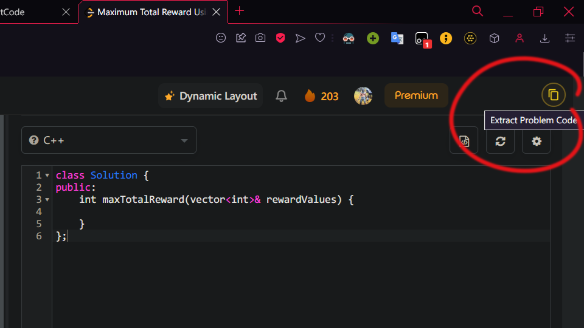
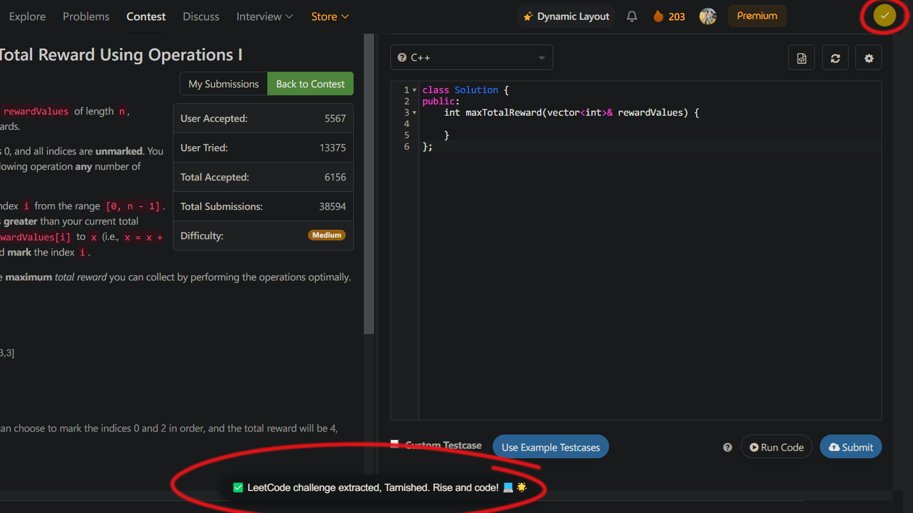

# LeetSouls: Code Extractor

LeetSouls is a browser extension that extracts code from LeetCode contest problems and converts it into an editable C++ template, ready for use in your preferred IDE. Perfect for LeetCode enthusiasts looking to optimize their contest workflow and focus more on problem-solving rather than setup.

## Tech Stack

- JavaScript
- Chrome Extension APIs
- DOM Manipulation

## Features

- Extracts problem code from LeetCode contest pages
- Converts the extracted code into a fully functional C++ template
- Automatically copies the generated code to your clipboard
- Includes sample test cases in the main function for quick testing

## Screenshots


*LeetSouls button on a LeetCode contest page*


*Notification popup after successful code extraction*

These screenshots demonstrate the LeetSouls extension in action. The first image shows the LeetSouls button integrated into the LeetCode contest interface, ready for use. The second image displays the unique, Dark Souls-themed notification that appears after the code has been successfully extracted and copied to your clipboard.

## Template Structure

The generated C++ template follows this structure:

```cpp
// Generated By LeetSouls
#include <bits/stdc++.h>
using namespace std;

// Extracted function goes here

int main() {
    // Sample test cases go here
    return 0;
}
```

## Installation

As LeetSouls is not currently available on the Chrome Web Store, you'll need to install it manually as an unpacked extension. Follow these steps:

1. Download the extension:
   - Go to the [LeetSouls GitHub repository](https://github.com/your-username/leetsouls)
   - Click on the "Code" button and select "Download ZIP"
   - Extract the downloaded ZIP file to a location on your computer

2. Open Google Chrome and navigate to `chrome://extensions/`

3. Enable "Developer mode" by toggling the switch in the top right corner

4. Click on "Load unpacked" button that appears after enabling Developer mode

5. Navigate to the folder where you extracted the LeetSouls files and select it

6. The LeetSouls extension should now appear in your list of installed extensions

7. Pin the extension to your Chrome toolbar for easy access during LeetCode contests

Note: As this is a developer mode installation, you may see a reminder about running extensions in developer mode when you start Chrome. This is normal for manually installed extensions.

Remember to keep the extracted folder intact, as removing it will disable the extension.

## Usage

- Navigate to a LeetCode contest problem.
- Click the LeetSouls copy button that appears on the top-right corner.
- The extracted code template is now in your clipboard, ready to be pasted into your preferred IDE.
- Look out for a quirky, Dark Souls-inspired notification confirming successful extraction.

Note: This extension is designed to work only with LeetCode's classic editor mode. It may not function correctly if you're using the new dynamic editor mode, as LeetCode has removed access to the page source in this mode.
